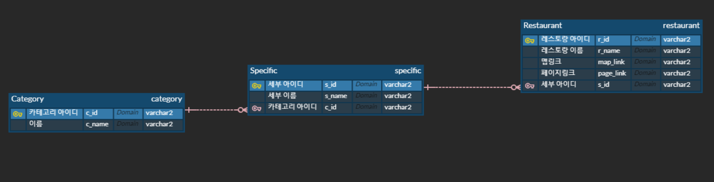
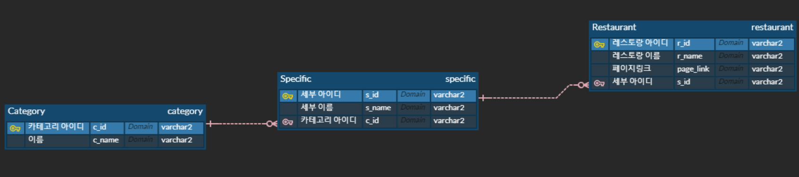

:fork_and_knife: Restaurant Recommendation System 
=================================================

#

## :pencil:Description
매번 점심 메뉴를 정하느라 낭비하는 시간을 절약하기 위해 play data학원을 중심으로 한식, 중식, 양식, 일식 카테고리 별로 맛집을 추천해주는 프로그램

#

## :bar_chart:ER Diagram


#

## :mag:페이지 프로세스 (oven url)
https://ovenapp.io/view/1AGe1dM0HzIfbU4de1wGfCy8VWyBBqGu/

#

## :question::exclamation:Issue
> 1. 엔티티의 모든 속성이 아닌 특정 속성만 select하는 상황
- 모든검색인 경우 해당 객체로 매핑됨
- select id 인 경우 String이 결과로 반환되기 때문에 해당 앤티티로 매핑이 안됨.
- 따라서 Query createNativeQuery(String sqlString, Class resultClass)메소드 대신 Query createNativeQuery(String sqlString)메소드 사용하여 해결

<details>
<summary>문제 발생 부분</summary>
<div markdown="1">

```java
@Slf4j
public class CategoryDAO {
	//cname으로 cid 찾아오기
	public static String getCid(String cname) throws Exception {
		EntityManager em = PublicCommon.getEntityManger();
		String cid = null;

		try {
			 cid = String.valueOf(em.createNativeQuery("select c_id from category where c_name=?")
					.setParameter(1, cname).getSingleResult());
                    /* 문제 발생 코드
                    String.valueOf(em.createNativeQuery("select c_id from category where c_name=?",CategoryEntity.class)
					.setParameter(1, cname).getSingleResult());*/
				if (cid == null) {
				log.info("select category id 실패");
				throw new NotExistException("select category id 실패");
			}
		} catch (Exception e) {
			log.warn("getCid : 오류발생");
			e.printStackTrace();
			throw e;
		} finally {
			em.close();
		}
		return cid;
	}
}
```
</div>
</details>

<details>
<summary>Query createNativeQuery 메소드</summary>
<div markdown="1">

```java
    /**
     * Create an instance of <code>Query</code> for executing
     * a native SQL query.
     * @param sqlString a native SQL query string
     * @param resultClass the class of the resulting instance(s)
     * @return the new query instance
     */
    public Query createNativeQuery(String sqlString, Class resultClass);

    /**
     * Create an instance of <code>Query</code> for executing
     * a native SQL statement, e.g., for update or delete.
     * If the query is not an update or delete query, query
     * execution will result in each row of the SQL result
     * being returned as a result of type Object[] (or a result
     * of type Object if there is only one column in the select
     * list.)  Column values are returned in the order of their
     * appearance in the select list and default JDBC type
     * mappings are applied.
     * @param sqlString a native SQL query string
     * @return the new query instance
     */
    public Query createNativeQuery(String sqlString);
```
</div>
</details>

#

> 2. Entity에 FK변수 추가시 주의점
- table에서는 varchar2타입의 FK가 Entity에서는 참조하는 객체 타입으로 변수선언됨
- 따라서 String값으로 입력된 파라메터를 객체 타입으로 반환하는 메소드를 구현


<details>
<summary>RestaurantEntity</summary>
<div markdown="1">

```java
@Entity
@Table(name="restaurant")
public class RestaurantEntity {
		
@Id
@Column(name="r_id")
private String rid;
		
@Column(name="r_name")
private String rname;
		
@ManyToOne
@JoinColumn(name="s_id")
private SpecificEntity sid;
		
@Column(name="map_link")
private String maplink;
		
@Column(name="page_link")
private String pagelink;				
}
	
 ```

</div>
</details>

<details>
<summary>SpecifictEntity</summary>
<div markdown="1">

```java

@Entity
@Table(name="specific")
public class SpecificEntity {
	
	@Id
	@Column(name="s_id")
	private String sid;
	
	@Column(name="s_name")
	private String sname;
	
	@ManyToOne
	@JoinColumn(name="c_id")
	private CategoryEntity cid;
	
	@OneToMany(mappedBy="sid")	
	private List<RestaurantEntity> restaurants;
}
	
 ```

</div>
</details>

<details>
<summary>restaurant insert 코드</summary>
<div markdown="1">

```java

		String url = "showError.jsp";
		String rid = request.getParameter("rid");
		String rname = request.getParameter("rname");
		SpecificEntity sid=null;
		String maplink = request.getParameter("maplink");
		String pagelink = request.getParameter("pagelink");
		
		
		sid = FoodService.getSpecificEntity(request.getParameter("sname"));
		RestaurantEntity restaurant = new RestaurantEntity(rid, rname, sid, maplink, pagelink);
	
 ```

</div>
</details>

#

> 3. JSTL에서 엔티티의 FK(객체참조변수)의 string값에 접근
- table에서는 varchar2타입의 FK가 Entity에서는 참조하는 객체 타입으로 변수선언됨
- data라는 객체(Specific Entity타입)의 String타입의 c_id를 추출하기 위해 data.cid(Category Entity타입).cid(String 타입)으로 접근
- JSTL에서 문자열 비교시 '='시 문제 발생, 'eq' 사용하여 해결

<details>
<summary>restaurant insert 코드</summary>
<div markdown="1">

```java

<c:forEach items="${sessionScope.specifics}" var="data">
	<c:choose>
		<c:when test="${data.cid.cid eq 'c_1'}">
```

</div>
</details>

#
:up: Upgrade to Ver2
====================
#
## :bar_chart:ER Diagram ver2


## :open_file_folder: Kakao Map opensource API 사용
기존에 DB에 저장된 외부링크를 통해 구현했던 카카오맵을 비동기 방식으로 페이지에 삽입하기 위해 Kakao devleopers( https://developers.kakao.com/ ) 의 오픈소스를 통해 로컬에서 맵기능 구현
#
> 문제점 : 비동기 형식으로 맵을 구현하려고 했으나 지도가 로드되지 않음
- 브라우저의 동작 방식에 의해 HTML 태그들을 파싱하는 도중 script 태그를 만나게되면 파싱을 중단하고 javascript 파일을 로드 후 javascript 코드를 파싱한다. 이후 HTML 파싱을 계속하게 된다.
- 직접 태그를 넣어주거나 동기로 구현하게 되었을 경우 처음부터 모든 태그를 파싱하기 때문에 파싱 및 로딩과정에서 문제가 되지 않지만 비동기 방식으로 정보를 받아올 때 문제가 생김
- 예상원인 : 이미 모든 태그가 파싱된 상태에서 버튼 클릭시 비동기로 script 태그를 받아오게 되는데 이미 파싱이 끝난 시점이라 script태그 내부의 코드가 로드되지 않은 것 같다.
#
:bangbang: iframe사용 
- 비동기로 구현하려 부단한 노력을 하였지만 iframe 태그를 활용하여 동기방식으로 지도 페이지를 레스토랑 결과 페이지 내에 구현

<details>
<summary>iframe tag 추가부분 코드</summary>
<div markdown="1">

```
    function tokakaomap(r) {
        console.log(r);
        document.getElementById("tid").innerHTML = "<iframe id='test' scrolling='no' marginheight='0' marginwidth='0' width='1500' height='750' src='kakaoMap.jsp?value="
                + r + "' frameBorder='1'></iframe>"
    }
```

</div>
</details>


#
## :bulb: CONTROLLER - 다형성 사용 

- 객체 참조변수 1개(action)만 선언하고 같은 메소드 명(execute)을 사용하여 여러가지 기능을 할 수 있음.
- 다양한 메소드들을 클래스로 분리하는 구조로 변경하므로써 각 기능들의 독립성이 높아지고 유지보수성이 용이하다는 장점이 있다.

<details>
<summary>FoodController 코드</summary>
<div markdown="1">


```java
package controller;

import java.io.IOException;
import javax.servlet.*;
import controller.action.Action;


@WebServlet("/total")
public class FoodController extends HttpServlet {	
	protected void service(HttpServletRequest request, HttpServletResponse response) throws ServletException, IOException {
		request.setCharacterEncoding("UTF-8");
		
		String command = request.getParameter("command");
		if(command==null) {
			command="main";
		}
		ActionFactory af = ActionFactory.getInstance();
		Action action = af.getAction(command);
		action.execute(request, response);
	}	
}
```

</div>
</details>


<details>
<summary>ActionFactory 코드</summary>
<div markdown="1">

```java

package controller;

import controller.*;

public class ActionFactory {

	private static ActionFactory instance = new ActionFactory();
	private ActionFactory(){}
	public static ActionFactory getInstance(){
		return instance;
	}
	public Action getAction(String command){
		Action action = null;
				
		if(command.equals("restaurantgetAll")){
			action = new RestaurantgetAll();
		}else if(command.equals("restaurantUpdate")){
			action = new RestaurantUpdate();
		}else if(command.equals("restaurantUpdateReq")){
			action = new RestaurantUpdateReq();
		}else if(command.equals("restaurantInsert")){
			action = new RestaurantInsert();
		}else if(command.equals("restaurantDelete")){
			action = new RestaurantDelete();
		}else if(command.equals("getSpecifics")){
			action = new GetSpecifics();
		}else if(command.equals("getRestaurants")){
			action = new GetRestaurants();
		}else if(command.equals("main")){
			action = new MainPage();
		}
		return action;
	}
}

```

</div>
</details>

#
## :pushpin: script태그 위치
- body태그 최하단에 위치하는 것이 좋음
- HTML 파싱이 끝나고 DOM 트리가 생기기 전 자바스크립트가 실행되면서 DOM 객체를 조작할 경우 에러가 발생할 수 있다. 

#
## :gun: 비동기
- 카테고리화면에서 세부카테고리 화면으로 전환시 비동기 방식으로 구현
- mouseout :vs: mouseleave
	- mouseleave : 자식 요소에는 동작하지 않고 지정한 태그 범위에만 적용됨.
	- mouseout : 자식 요소에 접근해도 동작을 함. 이벤트가 자식들에게도 적용됨.
	
<details>
<summary>mouseleave이벤트 추가</summary>
<div markdown="1">

```java

	document.getElementById("categorytable").addEventListener('mouseleave', () => {
		location.reload();
	});

```
</div>
</details>
